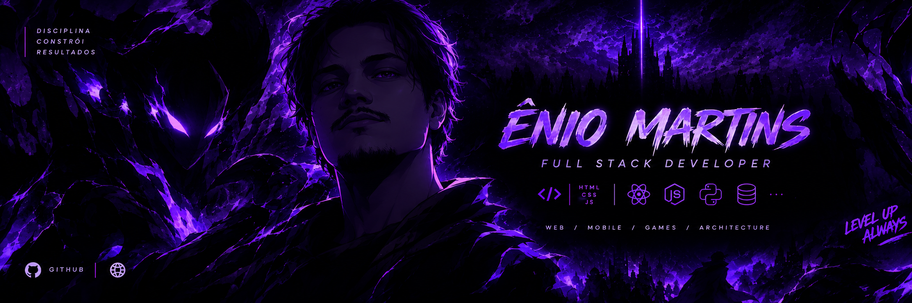
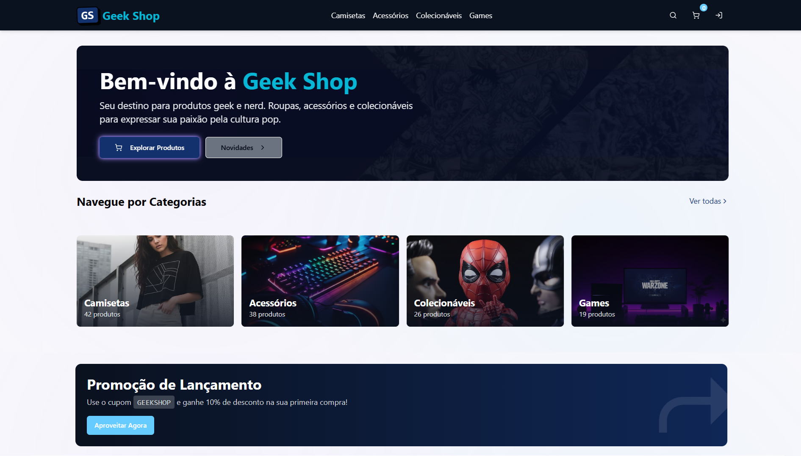
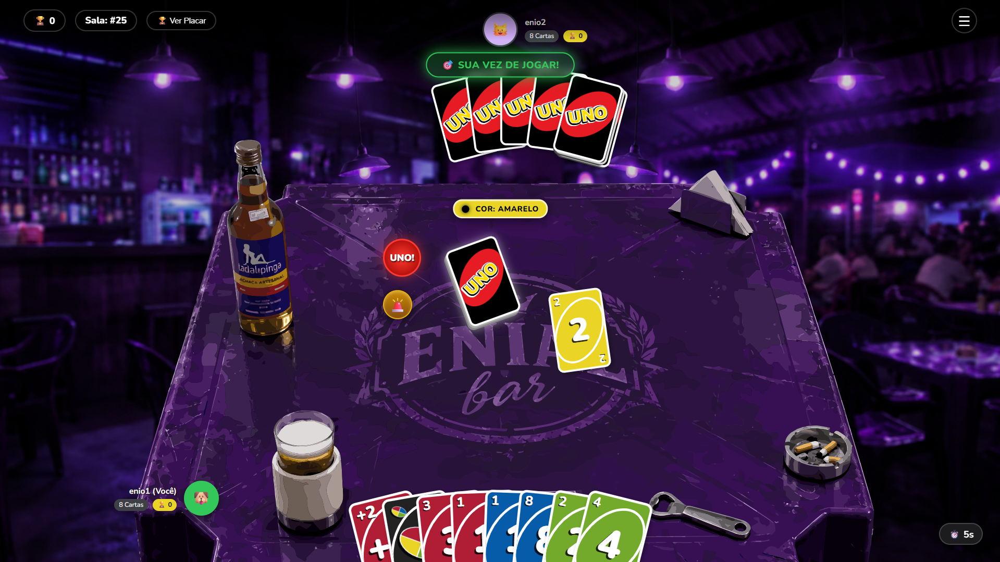

<div align="center">
  

  <a href="https://git.io/typing-svg">
    
  </a>
</div>

### `01 // PLAYER_IDENTIFICATION`

```text
╔═════════════════════════════════════════════════════════════════╗
║             [ P L A Y E R   I D E N T I F I C A T I O N ]       ║
╠═════════════════════════════════════════════════════════════════╣
║                                                                 ║
║  NAME       : Ênio Martins                                      ║
║  CLASS      : Full Stack Developer                              ║
║  LOCATION   : Belo Horizonte, Brazil                            ║
║  TITLE      : Software Engineering Student                      ║
║  MINDSET    : Leveling up through code. ARISE.                  ║
║                                                                 ║
║  [ DAILY QUEST: LEVEL UP ]                                      ║
║  - Architect scalable web solutions        : [ In Progress ]    ║
║  - Develop real-time applications          : [ Ongoing ]        ║
║  - Expand game development logic           : [ Ongoing ]        ║
║                                                                 ║
╚═════════════════════════════════════════════════════════════════╝
```

<br>

### `02 // TECH_STACK`

<p align="left">
  <!-- Front-end -->
  
  
  
  
  <br>
  <!-- Back-end -->
  
  
  
  
  <br>
  <!-- Infra, DB & Tools -->
  
  
  
  
</p>

<br>

### `03 // PROJECT_QUESTS`

<p>Galeria de projetos em destaque. <i>(Status: Concluídos e em evolução)</i></p>

<!-- Projeto 1: Imagem na Esquerda, Texto na Direita -->
<table width="100%" border="0" style="border: none;">
  <tr>
    <td width="50%" align="center" valign="middle">
      <a href="https://github.com/eniomartinst/geekshop">
        
      </a>
    </td>
    <td width="50%" valign="middle" style="padding-left: 20px;">
      <h3>🛒 Geekshop</h3>
      <p>Aplicação moderna desenvolvida com foco em arquitetura escalável e tecnologias Full Stack. Um e-commerce completo simulando regras de negócio reais.</p>
      <p><b>Tech:</b> <i>TypeScript, CSS</i></p>
      <a href="https://github.com/eniomartinst/geekshop">
        
      </a>
    </td>
  </tr>
</table>

<br>

<!-- Projeto 2: Texto na Esquerda, Imagem na Direita (Ziguezague) -->
<table width="100%" border="0" style="border: none;">
  <tr>
    <td width="50%" valign="middle" style="padding-right: 20px;" align="right">
      <h3>💡 Idea Voting Platform</h3>
      <p>Ecossistema distribuído de backend para idealização coletiva, apresentando microsserviços poliglotas, Clean Architecture e migração automatizada de banco de dados NoSQL.</p>
      <p><b>Tech:</b> <i>C#, Java, Python, Shell</i></p>
      <a href="https://github.com/eniomartinst/idea-voting-platform">
        
      </a>
    </td>
    <td width="50%" align="center" valign="middle">
      <a href="https://github.com/eniomartinst/idea-voting-platform">
        
      </a>
    </td>
  </tr>
</table>

<br>

<!-- Projeto 3: Imagem na Esquerda, Texto na Direita -->
<table width="100%" border="0" style="border: none;">
  <tr>
    <td width="50%" align="center" valign="middle">
      <a href="https://github.com/eniomartinst/pacman-game-recreation">
        
      </a>
    </td>
    <td width="50%" valign="middle" style="padding-left: 20px;">
      <h3>👾 Pac-Man Game</h3>
      <p>Recriação do clássico arcade desenvolvida em C# como parte dos estudos de programação e lógica de desenvolvimento de jogos.</p>
      <p><b>Tech:</b> <i>C#, CSS, JavaScript</i></p>
      <a href="https://github.com/eniomartinst/pacman-game-recreation">
        
      </a>
    </td>
  </tr>
</table>

<br>

<!-- Projeto 4: Texto na Esquerda, Imagem na Direita (Ziguezague) -->
<table width="100%" border="0" style="border: none;">
  <tr>
    <td width="50%" valign="middle" style="padding-right: 20px;" align="right">
      <h3>🍻 UNO-BAR</h3>
      <p>Aplicação Full Stack de um jogo de cartas multiplayer em tempo real, com foco em Alta Disponibilidade, WebSockets, Prevenção de Concorrência e Clean Architecture.</p>
      <p><b>Tech:</b> <i>JavaScript, CSS, Docker</i></p>
      <a href="https://github.com/eniomartinst/UnoBar">
        
      </a>
    </td>
    <td width="50%" align="center" valign="middle">
      <a href="https://github.com/eniomartinst/UnoBar">
        
      </a>
    </td>
  </tr>
</table>

<br>

### `04 // SYSTEM_METRICS`

<div align="center">
  
</div>

<br>

### `05 // CONTRIBUTION_MATRIX_SNAKE`

<p align="center">
  
</p>

### `06 // CONNECT`

<p align="center">
  <a href="mailto:eniomt1.0@gmail.com">
    
  </a>
  <a href="https://instagram.com/enio.martinst">
    
  </a>
</p>
